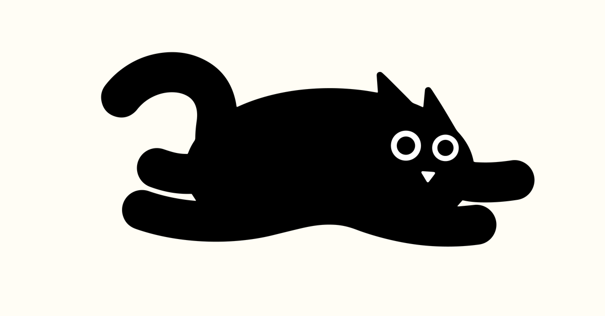

# QShala — India's Curiosity Company Web Platform

<div align="center">
  
  
  <br /><br />

  
  
  # 🐾 Meet QT & The QShala Curiosity Platform

  > **Mission**: Replacing Rote Learning with Curiosity, Socratic Storytelling, Questions, and Wonder.

  [](https://astro.build)
  [](https://react.dev)
  [](https://www.typescriptlang.org)
  [](https://tailwindcss.com)

</div>

---

## 🌟 Key Features & Architecture

### 1. 🐱 QT Mascot Stage (`AnimatedHeroMascotStage.tsx`)
- Interactive spring-animated mascot guide featuring **QT the Black Cat**.
- Reactive speech bubbles that dynamically change according to QT's curiosity mood (*Curious QT*, *Sherlock QT*, *Eureka QT*, *Scholar QT*, *Winner QT*).
- Integrated across pages with custom SVGs from QShala's official brand asset library (`public/assets/qt/`).

### 2. 🎲 Rolling Stat Counter Cards (`RollingStatCounters.tsx`)
- Animated 2-second slot-machine count-up physics with ease-out cubic slowdown.
- High-contrast neobrutalist metric cards:
  - **`250+`** `SCHOOLS PARTNERED` (Sky Blue `#30B2E7`)
  - **`80+`** `CORPORATE CLIENTS` (Gold `#FDB913`)
  - **`4.9★`** `AVERAGE RATING` (Leaf Green `#75B543`)
  - **`18+`** `CITIES COVERED` (Sky Blue `#30B2E7`)

### 3. 📚 10+ Storytelling Case Studies Showcase (`InteractiveCaseStudiesShowcase.tsx`)
- Interactive category filter pills (*`All (10)`*, *`Schools (3)`*, *`Corporates (4)`*, *`Colleges (2)`*, *`Communities (1)`*).
- Switchable view modes: **`Featured View`** vs **`Grid View`**.
- Encapsulated carousel controls with dot indicators and next/prev arrow buttons contained inside the case study card box.

### 4. 🎯 Compact Tailored Curiosity Finder (`CuriosityRecommendationWidget.tsx`)
- Neobrutalist role selector pills (*School Educator*, *HR / Corporate*, *Parent / Family*, *Fest Organizer*).
- Instant recommendation output with direct program booking links.

### 5. ⚡ 5-Scene Curiosity Loading Screen (`LoadingScreen.tsx`)
- Navigation timing inspector (`performance.getEntriesByType('navigation')`).
- Plays the 5-stage curiosity animation on direct visits and page reloads while bypassing it on internal page link clicks for lightning-fast page transitions.

### 6. 🔐 QShala Mission Control Admin Dashboard (`/admin`)
- Passcode-protected administrative portal (`1234` / `admin` or Quick Demo Access).
- Lead Management Table with status triggers, Question Bank Editor, Curiosity Store Inventory Control, and Magazine Post Manager.

### 7. 📲 Animated Mascot Social Share Previews (`BaseLayout.astro`)
- Full OpenGraph, Twitter Cards, and WhatsApp metadata resolution.
- Optimized 129KB social preview card (`og-image.jpg`) paired with animated GIF/WebP previews (`og-image.gif`, `og-image.webp`).

---

## 🎨 Brand Identity & Guidelines

| Brand Token | Hex Code | Purpose |
| :--- | :--- | :--- |
| **Qurious Sky** | `#30B2E7` | Primary Action Buttons & Accents |
| **Joy of Quest** | `#FDB913` | Highlight Badges & Hero Buttons |
| **Always Questioning** | `#75B543` | Impact Metrics & Success States |
| **Warm Cream Canvas** | `#FFFDF5` | Editorial Background Canvas |

### Typography Stack
- **Mikado** (`--font-mikado` for Schools & playful headlines)
- **Causten Round Black** (`--font-causten-black` for headers)
- **Causten Round** (`--font-causten-round` for body copy)

---

## 🗺️ Site Navigation & Routes

1. `/` — Home (Hero Stage, Rolling Counters, Bento Grid, Quiz Cards, Client Marquee)
2. `/about` — Our Story, Socratic Philosophy & QT Mascot Spotlight
3. `/services` — Program Formats for Schools, Corporates, Colleges & Communities
4. `/schools` — QShala K-12 Curiosity Curriculum & Weekly Clubs
5. `/companies` — Corporate Offsites, Trivia Nights & Workplace Culture
6. `/book-a-quiz` — 4-Step Interactive Quiz Booking Wizard
7. `/learn` — Kids Corner & Daily Socratic Trivia
8. `/case-studies` — 10+ Storytelling Impact Studies (DPS Bangalore, Wipro, Flipkart, etc.)
9. `/shop` — Curiosity Store (Handcrafted Decks & Learning Kits)
10. `/blog` — QShala Magazine Index & Dynamic Article Views (`/blog/[slug]`)
11. `/team` — Meet the Founders & QT Curiosity Crew
12. `/contact` — Contact Form & Campus Address Details
13. `/admin` — QShala Admin Control Panel

---

## 🛠️ Technology Stack

- **Framework**: Astro 5 (Static Architecture + React Islands)
- **UI Components**: React 19
- **Language**: TypeScript
- **Styling**: Vanilla CSS & TailwindCSS v4
- **Animations**: Framer Motion
- **Interactive FX**: Canvas Confetti
- **Icons**: Lucide React & Official QShala Brand SVGs

---

## 🚀 Getting Started

### 1. Clone the repository
```bash
git clone https://github.com/PavanKumar-HQ/Qshala.git
cd Qshala
```

### 2. Install dependencies
```bash
npm install
```

### 3. Run development server
```bash
npm run dev
```
Open [http://localhost:4321](http://localhost:4321) in your browser.

### 4. Build for production
```bash
npm run build
```

---

## 📄 Official Contact Details

- **Phone**: +91 89716 76100
- **Email**: qshala@walnuts.co.in
- **Address**: 1st Floor, Fortuna 1, 8th Main Road, 14th Cross Road, JP Nagar 3rd Phase, Bengaluru, Karnataka - 560078

---

<div align="center">
  
  <p><b>Designed & Developed for QShala (Curiosita Educational Services / Walnuts). All rights reserved.</b></p>
</div>
